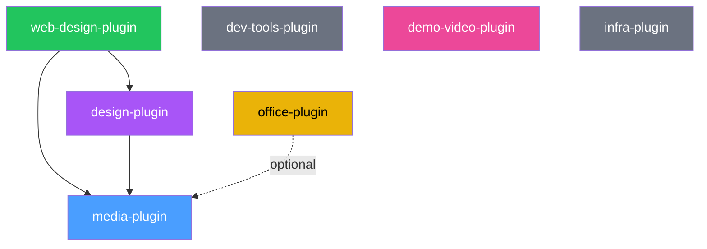

# codex-my-marketplace

[](https://github.com/lukaskellerstein/codex-my-marketplace)
[](plugins/)
[](plugins/)
[](https://learn.chatgpt.com/docs/plugins)

> A curated [OpenAI Codex](https://learn.chatgpt.com/docs/plugins) plugin marketplace for design, development, documentation, media generation, video production, and infrastructure management.

This marketplace adapts [`claude-my-marketplace`](https://github.com/lukaskellerstein/claude-my-marketplace) for Codex. Its **7 plugins** contribute **44 skills**, **19 specialist agents**, **4 bundled command workflows**, and **9 MCP server integrations** across the software delivery lifecycle, from creative direction and implementation through documentation, deployment, and demo-video production.

## Features

- **Design to code, end to end**: creative direction, styleguides, and design systems from `design-plugin` feed a parallel React/Vite implementation and visual-review workflow in `web-design-plugin`.
- **Media generation**: images, video, music, speech, icons, charts, diagrams, and SVGs behind a visual-planning and prompt-quality gate.
- **Automated demo videos**: repository research, storyboard, deterministic app state, Playwright or OBS capture, voiceover, and a Remotion render or Final Cut Pro project.
- **Developer workflows**: read-only investigation, brainstorming, multi-repository PR delivery, dead-code analysis, dependency upgrades, and documentation maintenance.
- **Infrastructure expertise**: Kubernetes/GKE, Istio, Helm, Terraform, Traefik, Keycloak, and OAuth2 Proxy.
- **Office documents**: professional PowerPoint, Word, and Excel generation and editing.
- **Codex-native policy**: explicit-only controls for consequential developer skills, workspace permission defaults, native plugin manifests, MCP configuration, and lifecycle hooks.

## Plugins

| Plugin | Version | What it does | Skills | Agents |
|---|---:|---|---:|---:|
| [media-plugin](plugins/media-plugin) | `v1.15.1` | Image, video, music, speech, icon, SVG, and data-visualization workflows | 10 | 1 |
| [web-design-plugin](plugins/web-design-plugin) | `v1.6.0` | Brief to working React/Vite website or webapp | 4 | 11 |
| [dev-tools-plugin](plugins/dev-tools-plugin) | `v1.6.0` | Thinking, Q&A, git, code hygiene, dependencies, and docs | 9 | 2 |
| [demo-video-plugin](plugins/demo-video-plugin) | `v1.1.0` | Repository to narrated, edited demo video | 8 | 4 |
| [infra-plugin](plugins/infra-plugin) | `v1.1.0` | Kubernetes, Istio, Helm, Terraform, Traefik, and auth | 6 | - |
| [design-plugin](plugins/design-plugin) | `v1.3.0` | Creative direction, design systems, and design review | 4 | 1 |
| [office-plugin](plugins/office-plugin) | `v5.1.0` | PPTX, DOCX, and XLSX generation and editing | 3 | - |

### [media-plugin](plugins/media-plugin) `v1.15.1`

Media generation and manipulation for images, videos and GIFs, music, text-to-speech, icons, SVGs, and data visualizations. Google Gemini, ElevenLabs, D3.js, Mermaid, Draw.io, and Playwright sit behind a single visual-planning gate; `media-prompt-craft` then improves the production prompt before an asset is generated.

- **Skills:** `visual-planning`, `media-prompt-craft`, `image-generation`, `image-sourcing`, `video-generation`, `music-generation`, `speech-generation`, `icon-library`, `graph-generation`, `svg-mastery`
- **Agent:** `media-director`
- **Bundled commands:** `media-generate`, `media-assets`
- **MCP:** Gemini media, ElevenLabs, Mermaid, Draw.io, Playwright
- **Hooks:** Draw.io edge-routing post-processing and SVG sanity checks

### [web-design-plugin](plugins/web-design-plugin) `v1.6.0`

End-to-end website and webapp design, from a brief to working React/Vite code. It coordinates design direction, content architecture, media planning, parallel per-page implementation, assembly, and screenshot-driven visual iteration with an opinionated anti-slop workflow.

- **Skills:** `animation-system`, `page-architecture`, `css-architecture`, `variation`
- **Agents:** `design-doc-foundation`, `design-doc-animation`, `design-doc-data`, `design-doc-media`, `design-doc-pages`, `scaffold-builder`, `page-builder`, `assembler`, `variation-generator`, `visual-fixer-page`, `visual-fixer-app`
- **Bundled command:** `web-design`
- **MCP:** Playwright
- **Requires:** `design-plugin` and `media-plugin`

### [dev-tools-plugin](plugins/dev-tools-plugin) `v1.6.0`

General developer tooling for investigation, decision-making, git workflows, code hygiene, dependency management, spec synchronization, and project documentation.

Every skill in this plugin is **explicit-only**. Codex never selects one implicitly, so consequential actions such as committing and merging, rewriting lockfiles, or regenerating documentation remain under direct user control. Use `$brainstorm` when there is a decision to make and `$question` when there is a fact to investigate without changing files.

- **Skills:** `brainstorm`, `question`, `git-pr`, `dead-code`, `update-dependencies`, `sync-spec-kit`, `update-docs`, `update-feature-docs`, `update-readme`
- **Agents:** `dead-code-analyzer`, `sync-spec-kit-agent`
- **MCP:** Mermaid diagram validation

> [!CAUTION]
> Explicitly invoking `$git-pr` authorizes its guarded commit, push, pull-request, squash-merge, checkout, and pull workflow.

### [demo-video-plugin](plugins/demo-video-plugin) `v1.1.0`

Turns a project repository into a narrated, edited demo video. It researches the codebase, writes a storyboard, prepares deterministic demo state, and drives web, launched Electron, or already-running applications with Playwright. It records each section with Playwright video or OBS, generates ElevenLabs voiceover, reconciles measured durations into a timeline, then renders the cut with Remotion or exports it as a Final Cut Pro project. The FCP path treats motionVFX as a first-class source: it separates downloaded templates from mExtension placeholders, exposes preview stills and videos for visual selection, and supports token-selected titles, transitions, and effects.

- **Skills:** `demo-video`, `demo-setup`, `demo-scripting`, `demo-app-prep`, `demo-capture`, `demo-voiceover`, `demo-assembly`, `demo-review`
- **Agents:** `demo-researcher`, `demo-capture-operator`, `demo-remotion-builder`, `demo-frame-critic`
- **MCP:** Playwright with video capture, ElevenLabs
- **Hooks:** preflight, clip transcoding, audio probing, and artifact validation

See the [demo-video pipeline guide](plugins/demo-video-plugin/README.md) for its artifact contracts, capture drivers and recorders, Final Cut Pro workflow, requirements, and rerunnable stages.

### [infra-plugin](plugins/infra-plugin) `v1.1.0`

Infrastructure management for Kubernetes and GKE, Istio service mesh, Helm, Terraform, Traefik, and authentication with Keycloak or OAuth2 Proxy. Large operational references are split by concern so Codex loads only the guidance relevant to the current task.

- **Skills:** `auth`, `helm`, `istio`, `kubernetes`, `terraform`, `traefik`

### [design-plugin](plugins/design-plugin) `v1.3.0`

The creative-direction layer for intentional rather than generic AI-assisted design. It covers aesthetic strategy, styleguides, typography, color systems, accessible design systems, and structured design review. Media prompt crafting lives in `media-plugin` so both design and web workflows share one production standard.

- **Skills:** `styleguide`, `frontend-aesthetics`, `design-review`, `design-system`
- **Agent:** `design-director`
- **Bundled command:** `design`
- **Requires:** `media-plugin`

### [office-plugin](plugins/office-plugin) `v5.1.0`

Professional Office document generation and editing, including presentation layouts, polished Word documents, formula-aware spreadsheets, structural validation, and rendered visual review.

- **Skills:** `pptx`, `docx`, `xlsx`
- **Optional:** `media-plugin` enriches documents with generated charts, diagrams, and images; native document components remain available without it

## Architecture



- `web-design-plugin` requires `design-plugin` and `media-plugin`.
- `design-plugin` requires `media-plugin`.
- `office-plugin` works independently and uses `media-plugin` only when it is available.
- `dev-tools-plugin`, `demo-video-plugin`, and `infra-plugin` are standalone.

Codex's validated native plugin manifest does not currently encode plugin-to-plugin installation dependencies. Install the required companion plugins together as shown in [Quick Start](#quick-start).

### Skill invocation

Installed skills become available in a new Codex session. Ask for an outcome in plain language and Codex can select an applicable skill, or invoke one explicitly with `$<skill-name>`:

```text
Use $styleguide to define a visual direction for this product.
Use $demo-video to produce a 90-second demo for engineering leads.
Use $terraform to review this module for unsafe infrastructure changes.
```

The nine `dev-tools-plugin` skills require explicit `$skill-name` invocation because their `agents/openai.yaml` files set `policy.allow_implicit_invocation: false`.

The repository also retains four workflow definitions under `commands/` for parity with the source marketplace: `design`, `media-generate`, `media-assets`, and `web-design`. In Codex, skills and plain-language requests are the documented invocation interfaces.

### MCP server integrations

| Plugin | MCP server | Runtime | Purpose |
|---|---|---|---|
| media-plugin | `media-mcp` | `uvx` | AI image, video, music, and speech generation through Google Gemini |
| media-plugin | `ElevenLabs` | `uvx` | Text-to-speech, voice cloning, and audio tools |
| media-plugin | `mermaid` | HTTP | Diagram generation |
| media-plugin | `drawio` | `npx` | Interactive Draw.io diagram generation and editing |
| media-plugin | `media-playwright` | `npx` | Browser rendering and capture for D3.js charts |
| dev-tools-plugin | `mermaid` | HTTP | Syntax validation for documentation diagrams |
| web-design-plugin | `webdesign-playwright` | `npx` | Visual testing of built websites |
| demo-video-plugin | `demo-playwright` | `npx` | UI recording with Playwright video capture |
| demo-video-plugin | `demo-elevenlabs` | `uvx` | Narration, voice search, and optional music beds |

`npx` and `uvx` resolve their MCP packages when the servers start. The remote Mermaid integrations need no local server process.

### Hooks

| Plugin | Trigger | Purpose |
|---|---|---|
| media-plugin | after file writes | Post-process Draw.io edge routing and sanity-check written SVGs |
| demo-video-plugin | session start | Report missing demo tooling and current pipeline state when a `demo/` directory exists |
| demo-video-plugin | after recorded clips | Transcode clips to constant-frame-rate H.264 and measure duration |
| demo-video-plugin | after generated speech | Probe narration duration against its budget |
| demo-video-plugin | after artifact writes | Validate storyboard and timeline contracts |

Review hook commands when Codex asks you to trust an installed plugin. Imported hooks use the compatibility `CLAUDE_PLUGIN_ROOT` variable supplied by Codex.

## Quick Start

### 1. Add the marketplace

From the terminal:

```bash
codex plugin marketplace add lukaskellerstein/codex-my-marketplace
```

You can also open `/plugins` in Codex and browse configured marketplaces.

### 2. Install plugins

Install only what you need:

```bash
codex plugin add dev-tools-plugin@codex-my-marketplace
codex plugin add media-plugin@codex-my-marketplace
codex plugin add design-plugin@codex-my-marketplace
codex plugin add web-design-plugin@codex-my-marketplace
codex plugin add demo-video-plugin@codex-my-marketplace
codex plugin add office-plugin@codex-my-marketplace
codex plugin add infra-plugin@codex-my-marketplace
```

> [!IMPORTANT]
> Install `media-plugin` with `design-plugin`. Install both `design-plugin` and `media-plugin` with `web-design-plugin`. Codex does not install these companion plugins automatically.

Start a new Codex thread after installation so the newly installed skills and MCP servers are available.

### 3. Update

Refresh the Git marketplace snapshot:

```bash
codex plugin marketplace upgrade codex-my-marketplace
```

When developing from a local checkout, refresh every installed plugin from this marketplace in one pass:

```bash
./scripts/refresh-installed-plugins.sh
```

Preview the working set without changing plugin manifests or installations:

```bash
./scripts/refresh-installed-plugins.sh --dry-run
```

The script adds a fresh cachebuster and reinstalls only plugins that are already installed. Start a new Codex thread afterward to load the updated skills and tools.

## Usage

Most skills can trigger from a direct request. Use `$skill-name` when you want a particular workflow or when invoking any developer tool:

```text
# Design direction
Use $styleguide to create a bold editorial direction for a specialty coffee roaster.
Use $design-review to review the current UI against the approved styleguide.

# Media
Use $visual-planning to choose the right visuals for this landing page.
Use $image-generation to create a cinematic coffee-farm hero image.
Use $graph-generation to turn these metrics into an accessible chart.

# Developer workflow - explicit-only
Use $question to find where the auth token is refreshed.
Use $brainstorm to compare splitting the monolith API with keeping it intact.
Use $update-dependencies to upgrade this project's dependencies and verify the result.

# Infrastructure and deliverables
Use $terraform to review this infrastructure plan.
Use $pptx to make a six-slide Q3 pitch deck.
Use $demo-video to create a 90-second product demo for engineering leads.
```

For the demo-video toolchain, run `$demo-setup` once per machine before `$demo-video`. It checks or installs FFmpeg/ffprobe, Node.js 18 or newer, Playwright Chromium, Remotion dependencies, and `uvx`; narration also needs `ELEVENLABS_API_KEY`. OBS 30 or newer and Final Cut Pro are optional finishing paths.

## Environment Variables

`media-plugin` and `demo-video-plugin` use external generation services. `design-plugin` and `web-design-plugin` need the same keys when their workflows generate media. All other plugins work without API credentials.

| Variable | Used by | Description |
|---|---|---|
| `GEMINI_API_KEY` | media-plugin | Google Gemini API key for image, video, music, and speech generation through `media-mcp`. Create one at [Google AI Studio](https://aistudio.google.com/apikey). |
| `ELEVENLABS_API_KEY` | media-plugin, demo-video-plugin | ElevenLabs API key for text-to-speech, voice cloning, and demo narration. Create one at [ElevenLabs](https://elevenlabs.io). |
| `OBS_WEBSOCKET_PASSWORD` | demo-video-plugin (optional) | Password for the OBS recorder's WebSocket server. `OBS_WEBSOCKET_URL` overrides the default `ws://127.0.0.1:4455`. |
| `MEDIA_OUTPUT_DIR` | media-plugin | Preferred absolute output directory. Returning file paths instead of base64 keeps large media out of the conversation context. Defaults to the current directory. |

Do not store credentials in this repository.

### macOS and Linux

Add the values to `~/.zshrc`, `~/.bashrc`, or the shell profile you use:

```bash
export GEMINI_API_KEY="your-gemini-api-key"
export ELEVENLABS_API_KEY="your-elevenlabs-api-key"
export MEDIA_OUTPUT_DIR="/absolute/path/to/media/output"
```

Reload the shell:

```bash
source ~/.zshrc  # or ~/.bashrc
```

### Windows PowerShell

```powershell
[System.Environment]::SetEnvironmentVariable("GEMINI_API_KEY", "your-gemini-api-key", "User")
[System.Environment]::SetEnvironmentVariable("ELEVENLABS_API_KEY", "your-elevenlabs-api-key", "User")
[System.Environment]::SetEnvironmentVariable("MEDIA_OUTPUT_DIR", "C:\path\to\media\output", "User")
```

Restart the terminal after setting user-level environment variables.

## Codex Adaptations

The source marketplace changes frequently. This repository follows its active workflow families while translating Claude-specific mechanics into their Codex equivalents:

| Source behavior | Codex adaptation |
|---|---|
| Claude plugin manifests | Native `.codex-plugin/plugin.json` manifests |
| `disable-model-invocation` skill metadata | `agents/openai.yaml` with `policy.allow_implicit_invocation: false` |
| Plugin MCP declarations | `.mcp.json` companion files |
| Plugin installation dependencies | Documented manual companion installs |
| Claude hook paths | Codex hook lifecycle with compatibility root variables |
| Workspace access rules | `.codex/config.toml` permission profile |
| Claude-only LSP plugin manifests | Omitted until Codex documents a native equivalent |

The source marketplace's four `.lsp.json` plugins are therefore not published here. Their language servers are useful, but carrying over unsupported metadata would present them as installable without providing a Codex-native capability.

## Repository Structure

```text
├── .agents/
│   └── plugins/
│       └── marketplace.json       # Published marketplace entries
├── .codex/
│   └── config.toml                # Workspace permission profile
├── plugins/
│   └── <plugin-name>/
│       ├── .codex-plugin/
│       │   └── plugin.json        # Native plugin metadata
│       ├── skills/
│       │   └── <skill-name>/
│       │       ├── SKILL.md       # Skill instructions
│       │       └── agents/
│       │           └── openai.yaml
│       ├── agents/                # Specialist agent definitions
│       ├── commands/              # Bundled workflow definitions
│       ├── hooks/                 # Lifecycle hooks and helpers
│       ├── scripts/               # Deterministic workflow utilities
│       └── .mcp.json              # MCP server definitions
└── _archive/                      # Retired, unpublished plugins
```

Marketplace entries resolve to `./plugins/<plugin-name>`. Each active plugin has a matching native manifest, and archived plugins are deliberately absent from the marketplace.

## Adding a Plugin

1. Create `plugins/<name>/.codex-plugin/plugin.json` with at least `name`, `version`, and `description`.
2. Add skills under `skills/<skill-name>/SKILL.md`. Add `agents/openai.yaml` when a skill needs Codex-specific interface metadata or invocation policy.
3. Add only the components the plugin needs: `agents/`, `commands/`, `hooks/`, `scripts/`, assets, or `.mcp.json`.
4. Keep the plugin independent where possible. If another plugin is required, document the companion installation because native Codex manifests do not encode that dependency.
5. Register the plugin in `.agents/plugins/marketplace.json` with a local source path and installation policy.
6. Validate the manifest, every skill, structured configuration, and shell or Node helpers before publishing.

For local marketplace development:

```bash
codex plugin marketplace add .
codex plugin list
```

Use the cachebuster and reinstall flow from Codex's `plugin-creator` skill when changing an already installed local plugin.

## Archive

`_archive/` holds retired plugins for reference. They are not listed in `.agents/plugins/marketplace.json` and cannot be installed from this marketplace.

- [`_archive/paperclip-plugin`](_archive/paperclip-plugin): AI company advisor for the [Paperclip](https://paperclip.ing) platform, last published as `v2.0.3`
- [`_archive/company.md`](_archive/company.md): original design specification

To restore an archived plugin, move it back under `plugins/`, update its Codex manifest, and register it in the marketplace.

## Author

Lukas Kellerstein
