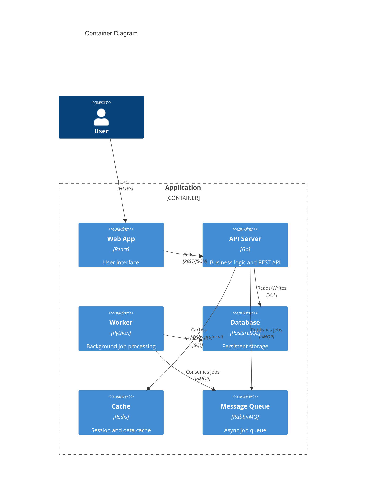

# C4 Container Diagram

Services, databases, message queues within a system. Paste into the Mermaid HTML template from SKILL.md.

```mermaid
C4Container
    title Container Diagram

    Person(user, "User")

    Container_Boundary(system, "Application") {
        Container(web, "Web App", "React", "User interface")
        Container(api, "API Server", "Go", "Business logic and REST API")
        Container(worker, "Worker", "Python", "Background job processing")
        Container(db, "Database", "PostgreSQL", "Persistent storage")
        Container(cache, "Cache", "Redis", "Session and data cache")
        Container(queue, "Message Queue", "RabbitMQ", "Async job queue")
    }

    Rel(user, web, "Uses", "HTTPS")
    Rel(web, api, "Calls", "REST/JSON")
    Rel(api, db, "Reads/Writes", "SQL")
    Rel(api, cache, "Caches", "Redis protocol")
    Rel(api, queue, "Publishes jobs", "AMQP")
    Rel(worker, queue, "Consumes jobs", "AMQP")
    Rel(worker, db, "Reads/Writes", "SQL")
```
