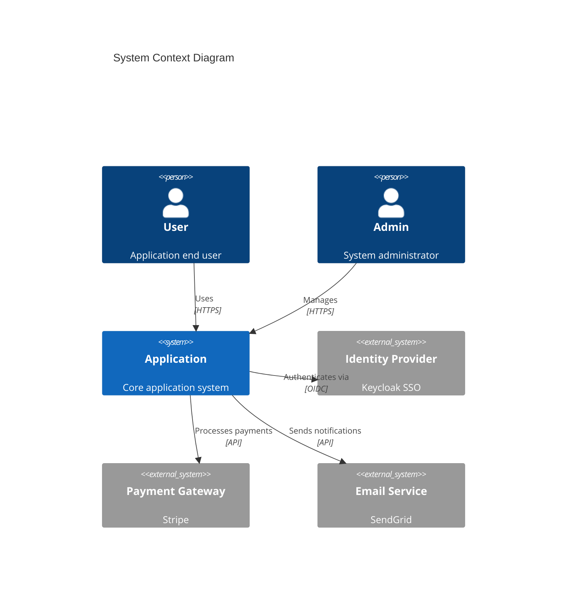

# C4 Context Diagram

System boundaries, external actors, high-level architecture. Paste into the Mermaid HTML template from SKILL.md.

```mermaid
C4Context
    title System Context Diagram

    Person(user, "User", "Application end user")
    Person(admin, "Admin", "System administrator")

    System(app, "Application", "Core application system")

    System_Ext(auth, "Identity Provider", "Keycloak SSO")
    System_Ext(payment, "Payment Gateway", "Stripe")
    System_Ext(email, "Email Service", "SendGrid")

    Rel(user, app, "Uses", "HTTPS")
    Rel(admin, app, "Manages", "HTTPS")
    Rel(app, auth, "Authenticates via", "OIDC")
    Rel(app, payment, "Processes payments", "API")
    Rel(app, email, "Sends notifications", "API")
```
