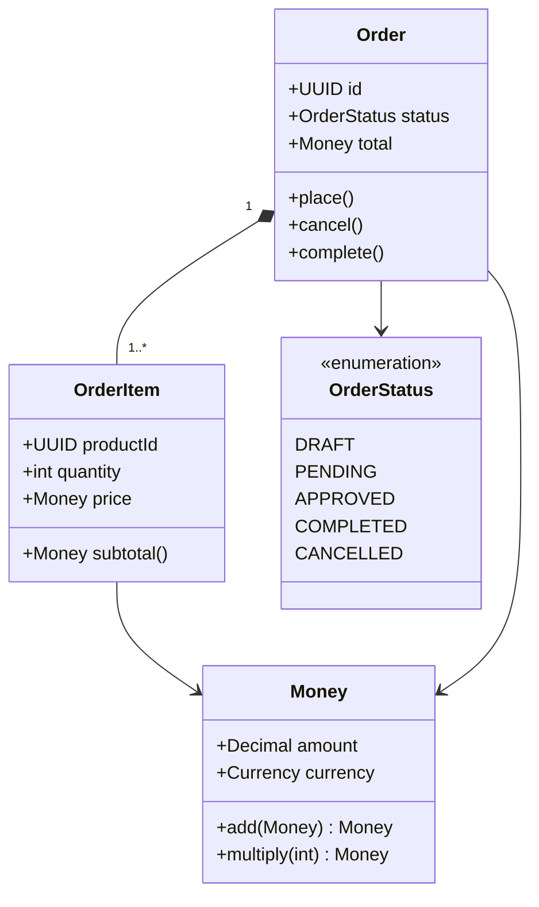

# Class / Domain Model Diagram

Object models, type hierarchies, domain models. Paste into the Mermaid HTML template from SKILL.md.

```mermaid
classDiagram
    class Order {
        +UUID id
        +OrderStatus status
        +Money total
        +place()
        +cancel()
        +complete()
    }

    class OrderItem {
        +UUID productId
        +int quantity
        +Money price
        +Money subtotal()
    }

    class Money {
        +Decimal amount
        +Currency currency
        +add(Money) Money
        +multiply(int) Money
    }

    class OrderStatus {
        <<enumeration>>
        DRAFT
        PENDING
        APPROVED
        COMPLETED
        CANCELLED
    }

    Order "1" *-- "1..*" OrderItem
    Order --> OrderStatus
    OrderItem --> Money
    Order --> Money
```
