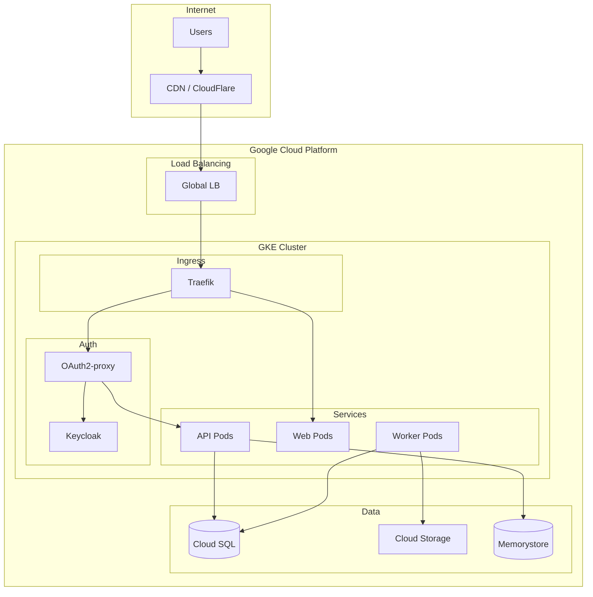

# Deployment Architecture Diagram

Cloud infrastructure, deployment topology. Paste into the Mermaid HTML template from SKILL.md.

```mermaid
flowchart TB
    subgraph Internet
        U[Users]
        CDN[CDN / CloudFlare]
    end

    subgraph GCP["Google Cloud Platform"]
        subgraph LB["Load Balancing"]
            GLB[Global LB]
        end

        subgraph GKE["GKE Cluster"]
            subgraph Ingress
                TR[Traefik]
            end

            subgraph Services
                API[API Pods]
                WEB[Web Pods]
                WRK[Worker Pods]
            end

            subgraph Auth
                KC[Keycloak]
                OA[OAuth2-proxy]
            end
        end

        subgraph Data
            SQL[(Cloud SQL)]
            GCS[Cloud Storage]
            MEM[(Memorystore)]
        end
    end

    U --> CDN --> GLB --> TR
    TR --> OA --> API
    TR --> WEB
    OA --> KC
    API --> SQL
    API --> MEM
    WRK --> SQL
    WRK --> GCS
```
