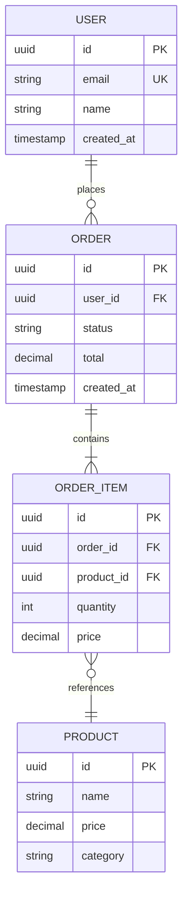

# Entity-Relationship Diagram

Database schemas, data models. Paste into the Mermaid HTML template from SKILL.md.

```mermaid
erDiagram
    USER ||--o{ ORDER : places
    USER {
        uuid id PK
        string email UK
        string name
        timestamp created_at
    }

    ORDER ||--|{ ORDER_ITEM : contains
    ORDER {
        uuid id PK
        uuid user_id FK
        string status
        decimal total
        timestamp created_at
    }

    ORDER_ITEM }o--|| PRODUCT : references
    ORDER_ITEM {
        uuid id PK
        uuid order_id FK
        uuid product_id FK
        int quantity
        decimal price
    }

    PRODUCT {
        uuid id PK
        string name
        decimal price
        string category
    }
```
