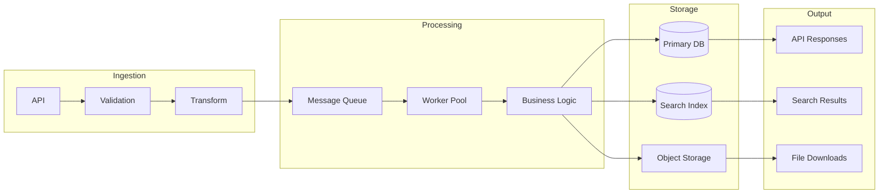

# Flowchart

Decision logic, process flows, data flows, algorithms. Paste into the Mermaid HTML template from SKILL.md.

```mermaid
flowchart LR
    subgraph Ingestion
        A[API] --> B[Validation]
        B --> C[Transform]
    end

    subgraph Processing
        C --> D[Message Queue]
        D --> E[Worker Pool]
        E --> F[Business Logic]
    end

    subgraph Storage
        F --> G[(Primary DB)]
        F --> H[(Search Index)]
        F --> I[Object Storage]
    end

    subgraph Output
        G --> J[API Responses]
        H --> K[Search Results]
        I --> L[File Downloads]
    end
```
