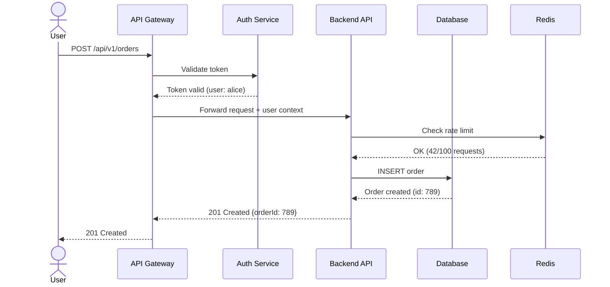

# Sequence Diagram

API calls, service interactions, request/response flows. Paste into the Mermaid HTML template from SKILL.md.

```mermaid
sequenceDiagram
    actor User
    participant GW as API Gateway
    participant Auth as Auth Service
    participant API as Backend API
    participant DB as Database
    participant Cache as Redis

    User->>GW: POST /api/v1/orders
    GW->>Auth: Validate token
    Auth-->>GW: Token valid (user: alice)

    GW->>API: Forward request + user context
    API->>Cache: Check rate limit
    Cache-->>API: OK (42/100 requests)

    API->>DB: INSERT order
    DB-->>API: Order created (id: 789)

    API-->>GW: 201 Created {orderId: 789}
    GW-->>User: 201 Created
```
