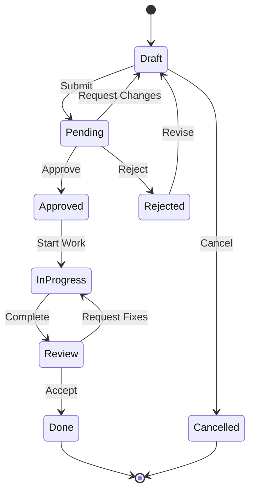

# State Machine Diagram

Lifecycle states, status transitions, workflows. Paste into the Mermaid HTML template from SKILL.md.

```mermaid
stateDiagram-v2
    [*] --> Draft

    Draft --> Pending: Submit
    Draft --> Cancelled: Cancel

    Pending --> Approved: Approve
    Pending --> Rejected: Reject
    Pending --> Draft: Request Changes

    Approved --> InProgress: Start Work
    Rejected --> Draft: Revise

    InProgress --> Review: Complete
    Review --> Done: Accept
    Review --> InProgress: Request Fixes

    Done --> [*]
    Cancelled --> [*]
```
